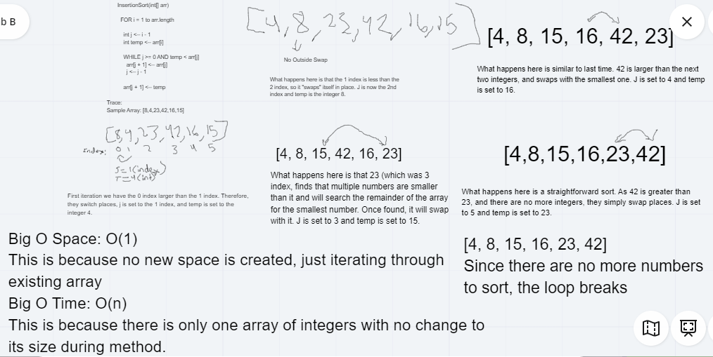

# Code Challenge Class 26: Insertion Sort
---

## Insertion Sort

*Authors: Robert Carter (Amanda Iverson gave pseudo code)

---

## Summary

Insertion Sorts allow a developer to sort an array without going through the entire array, just the part that needs to be sorted.
I wrote this code and whiteboard to best explain to someone with limited or zero knowledge of an insertion sort how to conduct one.

## Description

A C# implementation of an insertion sort to iterate the parts of an array that need to be sorted.
This is accomplised by creating two for loops with a nested while loop that iterate and sort an array until the conditions of the second for loop are met, then it stops iterating.

---

## Methods

| Method | Summary | Big O Time | Big O Space | Example | 
| :----------- | :----------- | :-------------: | :-------------: | :----------- |
| SortThrough | Sorts through a given integer array | O(n) | O(1) | SortThrough() |

---
### Approach

#### Sort Through()
1. Pass through blank int array
2. Create first for loop that sets index to "1" and runs the length of the array
3. int J is set to index - 1
4. Create while loop that runs while j is >= 0 and temp < array at j index
5. array at j + 1 is set to arr at j
6. j is set to j - 1
7. array at j + 1 is set to temp

### Efficiency
* Methods that have Big O efficiency O(n) for time
  * SortThrough(). Because we are only testing a single integer array, and only a portion of it at that, it saves on time.
 

* Methods that have Big O efficiency O(1) for space
  * SortThrough(). Because we are only iterating through part of an existing array, no new space is created

  
  
## Solution

---

## Change Log

1.1 Initial submission of app - 11 August 2020

---