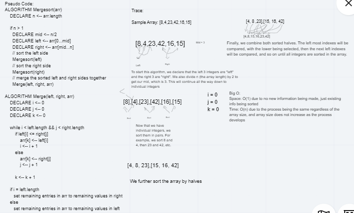

# Code Challenge Class 27: Merge Sort
---

## Merge Sort

*Authors: Robert Carter (Amanda Iverson gave pseudo code)

---

## Summary

Merge Sorts allow a developer to sort an array by splitting it down to its constituent integers or values, then recombine the array while sorting values at every step.
I wrote this code and whiteboard to best explain to someone with limited or zero knowledge of a merge sort how to conduct one.

## Description

A C# implementation of an merge sort to break down an existing array and recombine it through sorting and merging increasingly larger parts.
This is accomplised by dividing the array by twos until you have each individual value as it's own "array". While there are values left to compare, you then compare values against each other and merge them into increasingly large arrays, while finally taking two arrays and checking their left most value against each other, putting those values in a fully combined array.

---

## Methods

| Method | Summary | Big O Time | Big O Space | Example | 
| :----------- | :----------- | :-------------: | :-------------: | :----------- |
| MergeSort | Sorts through a given integer array by dividing it into individual integers, and slowly comparing larger groups until whole array is sorted | O(n) | O(1) | MergeSort() |

---
### Approach

#### Sort Through()
1. Declare a variable to be set as the array length
2. If the array length is greater than 1, declare Mid is array length / 2, Left is 0 index to mid, and Right is mid to largest index.
3. Continue this process until all arrays are one integer long.
4. Start merge by delcaring i = 0, j = 0, k = 0. i is left integer array, j is right, and k is blank array to seed data into.
5. While i is < left.length and j < right.length, compare their size. Whichever is less is put into k first, then the other integer second.
6. Add a space into blank array
7. Continue sorting arrays by this method until two are left
8. If I = left.length, then set remaining entries in arr to remaining values in right
9. Else set remaining entries in arr to remaining values in left
10. Return merged and sorted array

### Efficiency
* Methods that have Big O efficiency O(n) for time
  * MergeSort(). Because we are only testing a single integer array, and only a portion of it at that, it saves on time.
 

* Methods that have Big O efficiency O(1) for space
  * MergeSort(). Because we are only iterating through part of an existing array, no new space is created

  
  
## Solution

---

## Change Log

1.1 Initial submission of app - 12 August 2020

---