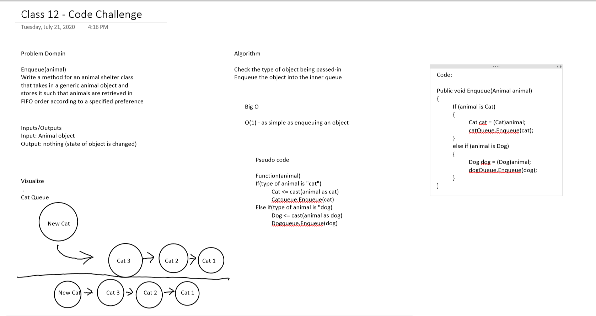

# Code Challenge 12: Fifo Animal Shelter
---

## Fifo Animal Shelter

*Authors: Robert Carter, Paul Rest, Michael Refvem*

---

## Summary

Queues are useful in storing data in a First In, First Out (FIFO) method. The ability to add nodes to a queue is Enqueue, and the ability to take nodes away is called Dequeue.
The ability to do this over a queue while looking for specific value types is also something one must master in order to manage more complex data structures
This app will have us make an animal shelter queue with different types of animals which, through dequeue, we are to return the values of either cat, dog, or null.

## Description

A C# implementation of the combination of two methods, enqueue and dequeue, which serve to manipulate data on queue which, in this case, is a simulated animal shelter.  
The purpose of this app is to ensure that nodes with string values can be added and subracted from the queue in a variety of ways, while also utilizing methods from prevoius code challenges through project reference. 

---

## Methods

| Method | Summary | Big O Time | Big O Space | Example | 
| :----------- | :----------- | :-------------: | :-------------: | :----------- |
| enqueue | Adds a node containing a new value to a queue | O(n) | O(n) | enqueue(string value) |
| dequeue | Returns value of the preferred animal, either dog or cat. If neither, null | O(1) | O(1) | dequeue() |

---
### Approach and Efficiency
* Methods that have Big O efficiency O(n) for time and space
  * enqueue(). 
  * dequeue().

  
## Solution

---

## Change Log

1.1 Initial submission of app - 21 July 2020

---

