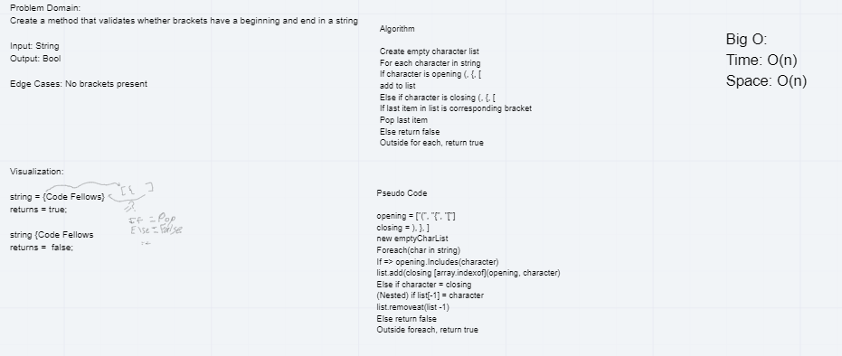

# Code Challenge 13: Multi Bracket Validation
---

## Multi Bracket Validation

*Authors: Robert Carter, Bade Habib, Nicholas Ryan*

---

## Summary

Opening and closing characters, whether they be parentheses or brackets, are important to utilize correctly, as failure to do so will invariably make code either fail or work in ways not intended.
We can validate that the open/close process has happened by using booleans. If the opening and closing characters are both detected in the correct order on a code string, it returns true. Else, it returns false.

## Description

A C# implementation of a method who's purpose is to verify that when an opening character (i.e. (, {, {) is typed, it has a corresponding closing character (i.e. ), }, ]).
The purpose of this app is to ensure that when opening and closing characters are used in a code string, a return value of true is given, and if not, a return value of false is given.

---

## Methods

| Method | Summary | Big O Time | Big O Space | Example | 
| :----------- | :----------- | :-------------: | :-------------: | :----------- |
| MultiBracketValidation() | Adds a node containing a new value to a queue | O(n) | O(n) | MultiBracketValidation(string input) |
| MultiBracketValidation() | Returns value of first (oldest) node in queue | O(1) | O(1) | MultiBracketValidation(string input) |

---
### Approach and Efficiency
* Methods that have Big O efficiency O(n) for time and space
  * MultiBracketValidation(). 

* Methods that have Big O efficiency O(n) for time and space
  * MultiBracketValidation().
  
## Solution

---

## Change Log

1.1 Initial submission of app - 22 July 2020

---

