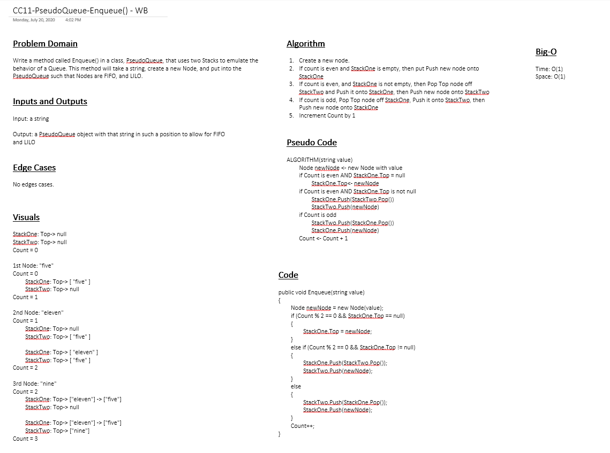

# Code Challenge 11: Queue in Stacks
---

## Queue with Two Stacks

*Authors: Robert Carter, Paul Rest, Michael Refvem*

---

## Summary

Queues are useful in storing data in a First In, First Out (FIFO) method. The ability to add nodes to a queue is Enqueue, and the ability to take nodes away is called Dequeue.
The ability to do this over multiple stacks within a queue is also something one must master in order to manage more complex data structures
This app will have us make a "pseudo" queue with two stacks of nodes and have us enqueue and dequeue them both in a variety of ways.

## Description

A C# implementation of the combination of two methods, enqueue and dequeue, which serve to manipulate data on a pseudo queue, which has in reality two stacks under it.  
The purpose of this app is to ensure that nodes with values can be added and subracted from the pseudo queue in a variety of ways.

---

## Methods

| Method | Summary | Big O Time | Big O Space | Example | 
| :----------- | :----------- | :-------------: | :-------------: | :----------- |
| enqueue | Adds a node containing a new value to a queue | O(n) | O(n) | enqueue(string value) |
| dequeue | Returns value of first (oldest) node in queue | O(1) | O(1) | dequeue() |

---
### Approach and Efficiency
* Methods that have Big O efficiency O(n) for time and space
  * enqueue(). 

* Methods that have Big O efficiency O(1) for time and space
  * dequeue().
  
## Solution

---

## Change Log

1.2 Changes made to Enqueue mehtod (collaboration with Paul Rest) - 21 July 2020
1.1 Initial submission of app - 20 July 2020

---

