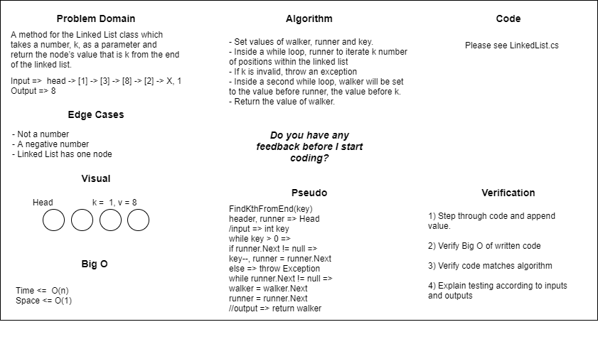

# Data Structure Implementation: Linked List
---

## Linked List - Append

*Author: Na'ama Bar-Ilan & Robert Carter*

---

## Description

A C# implementation of a `Singly Linked List`. Singly Linked Lists contain individual nodes that have a reference to the `Next` node in the list as well as a `Value`. The methods of this `Linked List` are `Insert`, `Includes`, `ToString`, and `Append`.

---

## Methods

| Method | Summary | Big O Time | Big O Space | Example | 
| :----------- | :----------- | :-------------: | :-------------: | :----------- |
| Insert | Adds a new `Node` to the `Linked List` | O(1) | O(1) | myList.Insert(99) |
| Includes | Takes in a value and returns a boolean depending on if the value is in the `LinkedList` | O(n) | O(1) | myList.Includes(99) |
| Append    | Adds a new node with a given value to the end of the `LinkedList` | O(n) | O(n) | myList.Append(99) |

---
### Approach

#### AppendNumber()
1. Set Current to Head
2. If Head is equal to null, set Heat to node
3. Else, while Current.Next is not equal to null, set Current to Current.Next
4. Set Current.Next to node

#### InsertBeforeMiddle()
1. Set Current to Head
2. If Current.Value = value, run Insert method passing the insertValue, then set Current to Current.Next
3. While Current.Next is not equal to null, if Current.Next.Value is equal to value...
4. Create a new node, passing in insertValue
5. Set Node.Next to Current.Next
6. Set Current.Next to node
7. Set Current to Current.Next
8. Outside of while loop set Current to Current.Next

#### InsertAfterNode()
1. While Current is not equal to null...
2. If Current.Value is equal to value, create a new node passing in newValue
3. Set node.Next to Current.Next
4. Set Current.Next to node
5. Set Current to Current.Next
6. Ouside of loop set Current to Current.Next

#### FindKthFromEnd()
1. Set values of walker, runner and set them to Head
2. Created key parameter for use to iterate while loop. 
3. Inside of first of two while loops, runner iterates through positions of linked list until key equals 0.
4. If runner.Next is not equal to null, decriment key value and set runner to runner.Next.
4. Else, if key is invalid, throw an exception
5. Inside a second of two while loops, while runner.Next is not equal to null, walker will be set to wallker.Next and runner will be set to runner.Next.
6. Return the value of walker after while loop is exited.

### Efficiency
* Methods that have Big O efficiency O(1) for time
  * AppendNumber(). Because we are adding a node to a linear Linked List, it requires more complex action
  * InsertBeforeMiddle().  Because we are adding a node to a linear Linked List, it requires more complex action
  * InsertAfterNode().  Because we are adding a node to a linear Linked List, it requires more complex action
  
* Methods that have Big O efficiency O(n) for time
  * FindKthFromEnd(). Because we are iterating through a linear Linked List, we do not have to navigate over additional lists or nodes.
  
* Methods that have Big O efficiency O(n) for space
  * AppendNumber(). Because it requires only adding a single node, it doesn't add a large amount of space.
  * InsertBeforeMiddle(). Because it requires only adding a single node, it doesn't add a large amount of space.
  * InsertAfterNode(). Because it requires only adding a single node, it doesn't add a large amount of space.
  
* Methods that have Big O efficiency O(1) for space
  * FindKthFromEnd(). Because we are simply accessing the value of an existing node and returning it, we aren't creating any additional nodes.
  
## Visuals

### Insert Method

*The Insert Method takes in an int as a parameter. A new Node is then created using the* 
*int param as its Value. The new Node is then placed in the Linked List at the Head and*
*the previous Head is assigned as the new Nodes Next.*

### Includes Method

*The Includes Method takes in an int as a parameter then iterates through the Nodes of the*
*Linked List checking all the Values. If the value is found True is returned, if not then*
*False is returned.*

### Append Method
*The Append method creates a new node with a given int value, then iterates through the nodes of the Linked List checking all the values. Once the last node on list is reached the method adds the new node to the end of the linked list.*

---

## Change Log
1.1 Finished both Challenge 6 and 7, with tests - 19 July 2020
---
