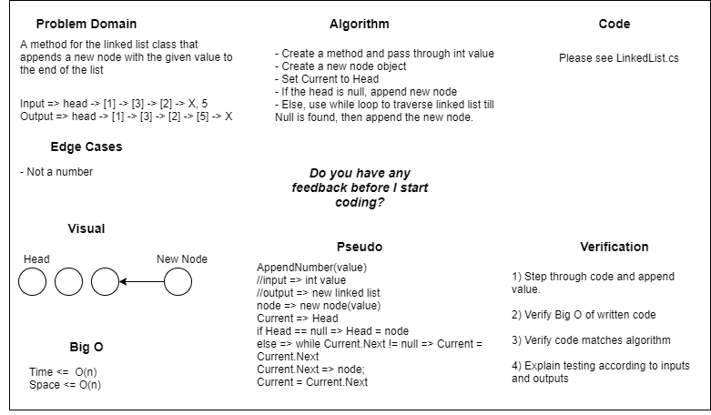

# Data Structure Implementation: Linked List
---

## Linked List - Append

*Author: Na'ama Bar-Ilan & Robert Carter*

---

## Description

A C# implementation of a `Singly Linked List`. Singly Linked Lists contain individual nodes that have a reference to the `Next` node in the list as well as a `Value`. The methods of this `Linked List` are `Insert`, `Includes`, `ToString`, and `Append`.

---

## Methods

| Method | Summary | Big O Time | Big O Space | Example | 
| :----------- | :----------- | :-------------: | :-------------: | :----------- |
| Insert | Adds a new `Node` to the `Linked List` | O(1) | O(1) | myList.Insert(99) |
| Includes | Takes in a value and returns a boolean depending on if the value is in the `LinkedList` | O(n) | O(1) | myList.Includes(99) |
| Append    | Adds a new node with a given value to the end of the `LinkedList` | O(n) | O(n) | myList.Append(99) |

---

## Visuals

### Insert Method

*The Insert Method takes in an int as a parameter. A new Node is then created using the* 
*int param as its Value. The new Node is then placed in the Linked List at the Head and*
*the previous Head is assigned as the new Nodes Next.*

### Includes Method

*The Includes Method takes in an int as a parameter then iterates through the Nodes of the*
*Linked List checking all the Values. If the value is found True is returned, if not then*
*False is returned.*

### Append Method
*The Append method creates a new node with a given int value, then iterates through the nodes of the Linked List checking all the values. Once the last node on list is reached the method adds the new node to the end of the linked list.*

---

## Change Log

---
