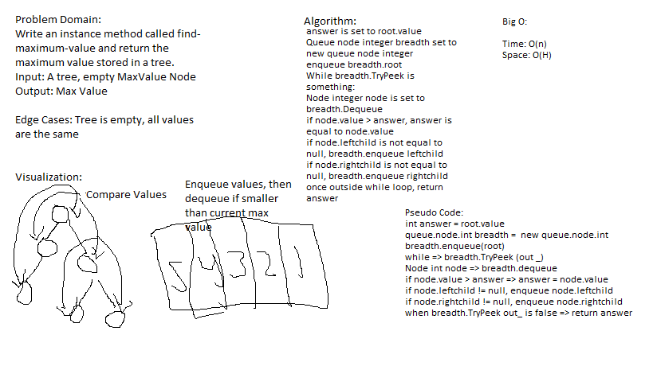

# Code Challenge 15: Binary Tree and BST Implementation
# Code Challenge 16: Find Maximum Binary Tree
---

## Binary Tree and BST Implementation

*Authors: Robert Carter (Amanda Iverson partial source code)
*Collaboration with: Bryant Davis, Trevor Stubbs

---

## Summary

Tree traversals are important ways to find and list data. 
I wrote tests for several types of tree traversals to verify they will work given a tree.
I also created a way to check for the largest value in a tree

## Description

A C# implementation of the PreOrder, InOrder, and PostOrder tree traversal methods. The purpose of this app is to traverse a given tree in a variety of ways.
This is accomplised by creating new trees and utilizing PreOrder (root down), InOrder(bottom left up, then right), and PostOrder(bottom left, then left, right going up to root).
This app also can check a given tree for the largest value by finding all nodes, enqueing them in a queue, checking them against each other, dequeueing lesser values, then returning the remaining value.

---

## Methods

| Method | Summary | Big O Time | Big O Space | Example | 
| :----------- | :----------- | :-------------: | :-------------: | :----------- |
| PreOrder | Starts at root and traverses tree | O(n) | O(1) | PreOrder() |
| InOrder | Starts at bottom left leaf and goes up and down tree | O(n) | O(1) | InOrder() |
  PostOrder | Starts at bottom left leaft and goes left to right all the way up to root | O(n) | O(1) | PostOrder() |
  MaxValue | Starts at root and traverses tree, enqueueing values to stack, checking to see which is greater, then dequeueing lesser values. Returns largest value | O(n) | O(H) | MaxValue() |

---
### Approach

#### PreOrder()
1. Create a new tree
2. Traverse tree starting from root
3. If left child exists, traverse to leaf
4. If right child exists, traverse to leaf
5. Return traversal

#### InOrder()
1. Create a new tree
2. Traverse tree starting from bottom left leaf
3. If left child exists, traverse to leaf
4. If right child exists, traverse to leaf
5. Return traversal

#### PostOrder()
1. Create a new tree
2. Traverse tree starting from root
3. If left child exists, traverse to leaf
4. If right child exists, even if root not reached, traverse to leaf
5. End traversal at root
5. Return traversal

#### MaxValue()
1. Create a new tree
2. Traverse tree starting from root
3. If a value for left or right child exists, enqueue it
4. Check if enqueued value is greater than previous value
5. If larger dequeue smaller value
5. Return remaining value

### Efficiency
* Methods that have Big O efficiency O(n) for time
  * PreOrder(). Because we are only traversing a single tree and nothing more complex, it is efficient for time
  * InOrder(). Because we are only traversing a single tree and nothing more complex, it is efficient for time
  * PostOrder(). Because we are only traversing a single tree and nothing more complex, it is efficient for time
  * MaxValue(). Because we are only traversing a single tree and nothing more complex, it is efficient for time

* Methods that have Big O efficiency O(H) for space
  * PreOrder(). Trees can be of varying height, so space is determined by height
  * InOrder(). Trees can be of varying height, so space is determined by height
  * PostOrder(). Trees can be of varying height, so space is determined by height
  * MaxValue(). Trees can be of varying height, so space is determined by height

  
  
## Solution

### Maximum Value

---

## Change Log

1.2 Added methods and tests for finding max value in a tree - 28 July 2020
1.1 Initial submission of app - 27 July 2020

---

